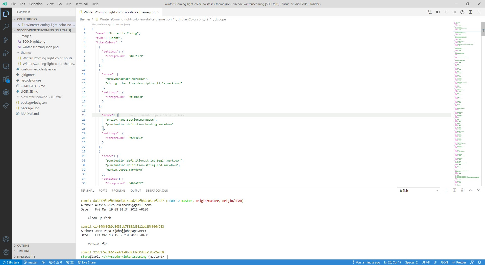

# Old Winter is Coming

This extension for Visual Studio Code adds themes titled "Old Winter is Coming". There are the original light themes (with italics and no italics version).

See the [CHANGELOG](CHANGELOG.md) for the latest changes.

## Light Theme

## Usage

Select the theme and go!

## Installation

1. Open **Extensions** sidebar panel in Visual Studio Code. `View → Extensions`
1. Search for `Old Winter is Coming`
1. Click **Install**
1. Click **Reload**
1. File > Preferences > Color Theme > **Old Winter is Coming (Light)**

## Credits

The original theme was done by John Papa and this fork focuses on what the theme looked like before the main refactor he did a year ago. Minor changes might be implemented but overall the look and feel will remain similar to how it's now.

Credit where credit is due ... this theme was inspired by the themes Visual Studio Dark+, Monokai and [Dustin Sander's theme for "An Old Hope"](https://marketplace.visualstudio.com/items?itemName=dustinsanders.an-old-hope-theme-vscode). Custom CSS inspired by [Wes Bos](https://twitter.com/wesbos). Blue background for the Dark them inspired by [Sarah Drasner](https://twitter.com/sarah_edo)'s [Night Owl theme](https://marketplace.visualstudio.com/items?itemName=sdras.night-owl)

## Authors

Maintained by [Alexis Rico](https://twitter.com/SferaDev)

Authored by [John Papa](https://twitter.com/john_papa)

Light theme co-authored by [Brian Clark](https://twitter.com/_clarkio)
